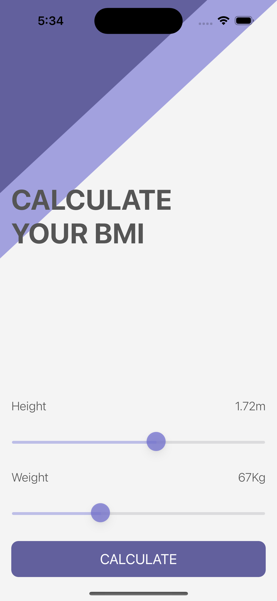
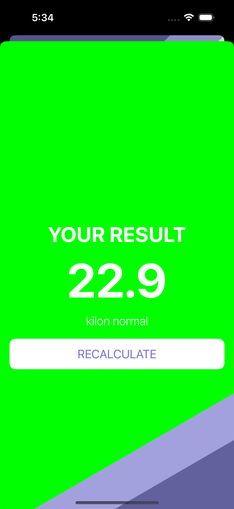

# BMI Calculator

## Overview

The BMI Calculator is a simple iOS application that calculates the Body Mass Index (BMI) of a user based on their height and weight inputs. The app takes in height and weight inputs using sliders in metric units (meters and kilograms) and calculates the BMI using the formula:

    BMI = weight / (height * height)

The calculated BMI value is then displayed along with a corresponding BMI category to help the user understand their BMI.

## What i learned

- How to create multi-screen apps with animated navigation.
- Optional binding, optional chaining and the nil coalescing operator.
- How to create classes and difference between classes and structs.
- Pass by value vs. pass by reference.
- Formatting Strings.
- Color literals.

## GIF

## Pictures

## Notes

- The BMI values and categories are based on the World Health Organization (WHO) guidelines.
- This app should not be used as a substitute for professional medical advice. Please consult with a healthcare professional for personalized medical advice.
